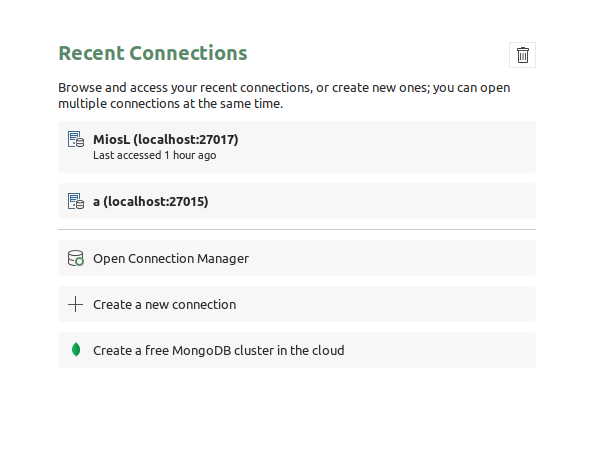
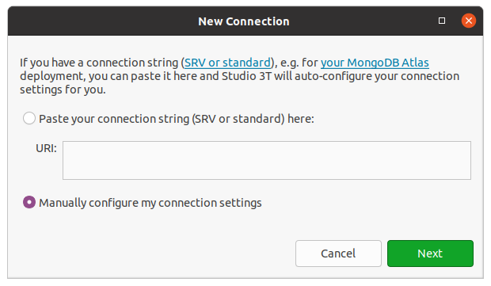
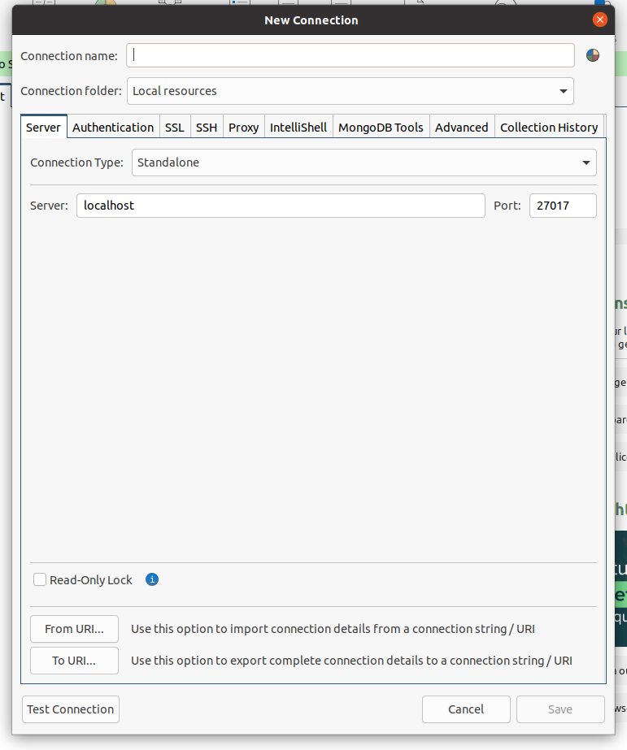
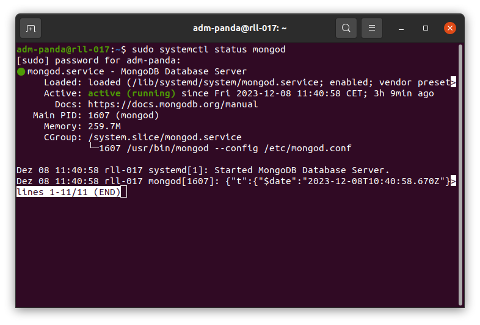
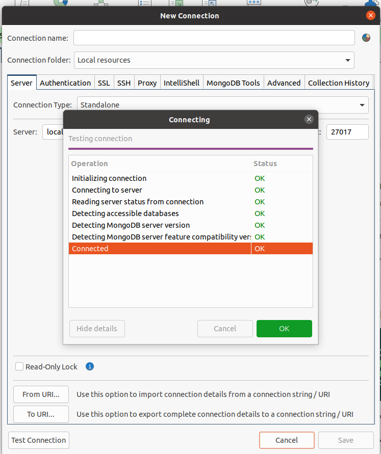
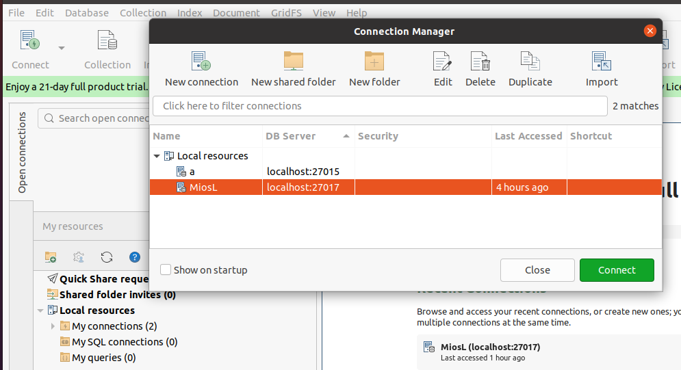
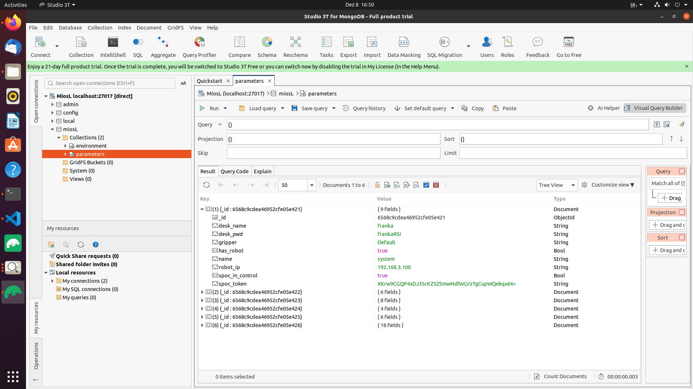

# 1. Why choose docker to control Franka Robots
Docker is a containerization platform widely adopted in software development and deployment. It ensures consistency across environments by encapsulating applications and dependencies, offers isolation for independent running containers, and promotes portability between different systems. Docker enhances efficiency with lightweight containers, enables version control for application environments, and supports seamless integration into DevOps practices for continuous integration and deployment. Its scalability, resource efficiency, and ability to define dependencies in Dockerfiles make it a popular choice, simplifying development workflows and fostering collaboration between development and operations teams.
# 2. How to install the platform on Linux
 While libfranka should work on Linux distributions, ubuntu 20.04 and 22.04 are feasible.

* Install docker https://docs.docker.com/engine/install/ubuntu/
* Install docker compose, hier must choose the specific version: 1.29.X https://www.digitalocean.com/community/tutorials/how-to-install-and-use-docker-compose-on-ubuntu-20-04

  - Add the `docker` group if it doesn't already exist:
  ```bash
    sudo groupadd docker
  ```
  - Add the connected user "$USER" to the `docker` group. Change the user name to match your preferred user if you do not want to use your current user:
  ```bash
    sudo gpasswd -a $USER docker
  ```
  - Either do a `newgrp docker` or log out/in to activate the changes to groups.
  - You can use
  ```bash
    docker run hello-world
  ```
  to check if you can run Docker without `sudo`.
* Install Studio 3T https://studio3t.com/knowledge-base/articles/how-to-install-studio-3t-on-linux/
* Install Mongodb https://www.mongodb.com/docs/manual/tutorial/install-mongodb-on-ubuntu/  
  - Open Studio 3T and click create a new connection


  - Click Manually configure my connection settings, then next


  - Enter the page, which is the page to be connected.


  - Start the MongoDb service  
  > Create a systemd service file:
  > > Create a file named `mongod.service` in the `/etc/systemd/system/` directory (you might need `sudo` permissions).
  ```bash
   sudo nano /etc/systemd/system/mongod.service
   ```
  > Edit the service file:
  > > Add the following content to the `mongod.service` file:
  > > > Note: Ensure that the `ExecStart` path is correct for your system.
  ```bash
    [Unit]
    Description=MongoDB Database Server
    After=network.target

    [Service]
    ExecStart=/usr/bin/mongod --config /etc/mongod.conf
    User=mongodb
    Group=mongodb
    Restart=always

    [Install]
    WantedBy=multi-user.target

  ```
  > Start the MongoDB service:
  ```bash
   mongodsudo systemctl start mongod
  ```
  > Enable MongoDB to start on boot:
  ```bash
  sudo systemctl enable mongod
  ```
  > Check the status of the MongoDB service:
  > > Please choose the appropriate method based on your Linux distribution and system version. The above steps assume that MongoDB is correctly installed, and the MongoDB configuration file is located at `/etc/mongod.conf`. If your configuration file is in a different location, modify the startup command accordingly.
  ```bash
  sudo service mongod status
  ```
  

  now the MongoDB service is active
  - Return to our open Studio 3T, click Test Connection in the lower left corner, you can see that the connection can be made, then click ok, and in the returned interface, name the connection, click save.
  
  - Connect to local Mongodbthe, click top left corner, our local MongoDb is shown here, click on it, and then connect

  
  The connection is now complete.
  - Edit the parameters, desk_name, desk_pwd, robot_ip

   
# 3. Configuration
* Copy the project from specific repository
```bash
  git clone https://gitlab.lrz.de/studenten/pymios.git
```
* Run docker compose
```bash
  cd pymios/docker
```
```bash
  docker compose up
  ```
  